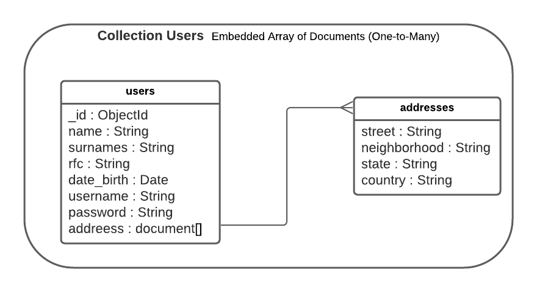

# Lok API RESTful
API RESTful CRUD Users with MongoDb (Microservice with Spring Boot) 

## Spring Boot 2 + Spring Data Rest + Spring Data MongoDB

## Getting started
### Prerequisites:
- Java 8
- Maven
- MongoDB

## Install mongo using docker 
```
docker run -d -p 27017:27017 --name=mongo mongo:4.2
```

## Default configuration ##
- Port: 8080 (By default, the embedded server starts on port 8080.)
    - A different port can be configured in an application.properties file.~~~~
```
server.port=8081
```
- Define the MongoDB connection parameters in an application.properties file.
```
spring.data.mongodb.host=HOST
spring.data.mongodb.port=PORT
spring.data.mongodb.authentication-database=AUTHENTICATION
spring.data.mongodb.username=USERNAME
spring.data.mongodb.password=PASSWORD
spring.data.mongodb.database=DATABASE
```
## Structure of the code ##
    Package
        - Api 
            - controller (CONTROLLER, CONFIG FILES & GlobalException)
            - dao (REPOSITORY)
            - model (MODEL, ENTITY, CUSTOM VALIDATE & UTILS)
            - service (LOGIC BUSSINES)

## Database diagram ##


## Deploy

- Installation as an init.d service
- FTP
- Upload file (server) lok-api-0.0.1-SNAPSHOT.jar into the path: /home/ubuntu

```
$ sudo mv lok-api-0.0.1-SNAPSHOT.jar service/
$ chmod 500 lok-api.jar
& sudo ln -s /home/ubuntu/service/lok-api.jar /etc/init.d/lokApi
& sudo service lokApi start
```

## Generate packaging (WAR) for deploy into server
```
$ mvn update
$ mvn clean install 
```

## Run the tests
- JUnit 5 + Mockito
```
$ mvn test 
```

## Swagger
* http://localhost:8080/swagger-ui/

## Collection Postman
* [Lok Collection](https://www.getpostman.com/collections/552bb2e28d9a218eb04d)

## Authors
* **Hugo Jurado García** - *Repository* - [LokChallenge](https://github.com/hugojuradogarcia/lok-challenge)